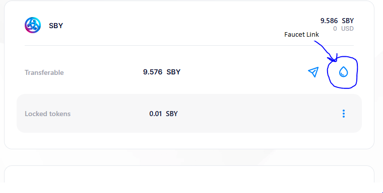

## POLKADOT INK SMARTCONTRACT EXAMPLES

 1. Flipper Smart Contract:

  The most basic smart contract written in İnk lang(Polkadot native smart contract language)

  - Download Polkadot smart contract cli -[Directives](https://github.com/use-ink/cargo-contract)
  - Need substrate node to test the code localy.[Download Substrate Node](https://github.com/paritytech/substrate-contracts-node/releases)
  Extract the tar file(using wsl cause pretty much all frameworks works on linux-macos systems)
  by
  ```
  tar -xvzf substrate-contracts-node-linux.tar.gz

  ```
  Make the file executable by 
  ```
  chmod +x substrate-contracts-node

  ```
And move the file into your PATH
```
sudo mv substrate-contracts-node /usr/local/bin/
```
this way you already set your execueble on path.

- After cli set up you can easly start your first flipper project by 
```
cargo contract new flipper
``` 
After completion just enter flipper folder to see the below format file tree.
```
flipper
  └─ lib.rs                <-- Contract Source Code
  └─ Cargo.toml            <-- Rust Dependencies and ink! Configuration
  └─ .gitignore
```

- For testing purposes (code alrready contains test env.)
use 
```
cargo test
```

- For compiling your ink contract in root folder of your project just run 
```
cargo contract build
```

After compilation you will notice new folder called target which it contains;
```
target
  └─ ink
    └─ flipper.contract
    └─ flipper.wasm
    └─ flipper.json
```
- Deploying the contract you have been build ;
[Run Substrate Node](https://use.ink/docs/v5/getting-started/running-substrate)
[Deployment](https://use.ink/docs/v5/getting-started/deploy-your-contract)

Pretty easy to deploy and interact with local and almost same as deploying into live testnet 

For example you want to deploy into astar shibuya(astar testnet) you only need some SBY(test token)

- Download polkadot js wallet , connect [Astar Shinuya](https://portal.astar.network/shibuya-testnet/assets) and click on drip icon to get your test tokens.


Rest of the deployment and interactions are same as mentioned in documents.